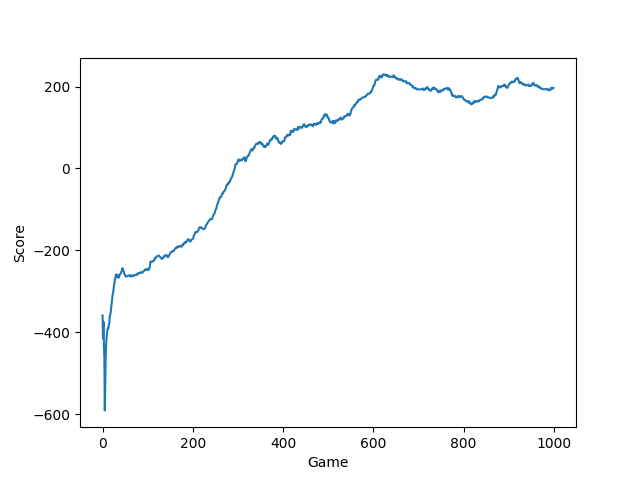

# Deep Deterministic Policy Gradient

A clean implementation of the Deep Deterministic Policy Gradient Algorithm using PyTorch. Referenced from https://github.com/philtabor/Youtube-Code-Repository/tree/master/ReinforcementLearning/PolicyGradient/DDPG/pytorch/lunar-lander  Fixed inconsistencies with the [original paper](https://arxiv.org/abs/1509.02971). Refactored the code and added epsilon-greedy exploration strategy, which improved training performance

## Sample training run
### Result from `main_demo.py`

### Result from original reference code
